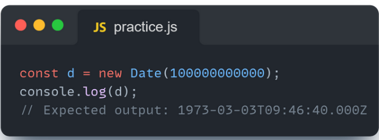
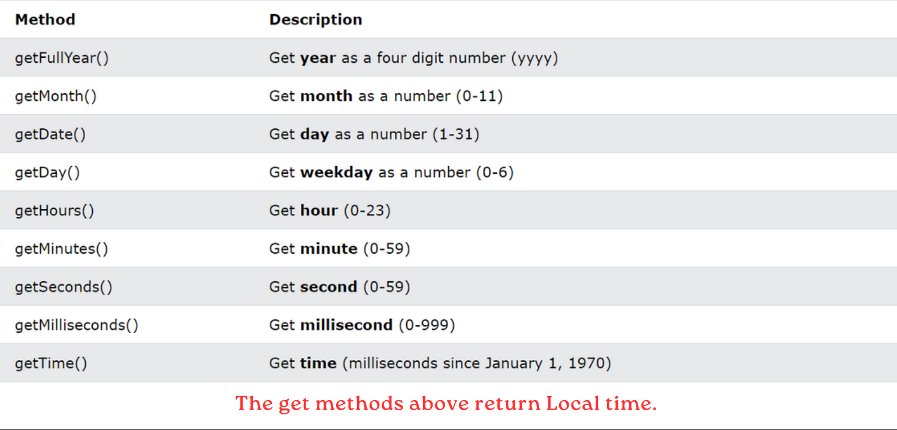

# What is new Date in JavaScript ?

## Creating date and time

## A JavaScript date is fundamentally specified as the time in milliseconds that has elapsed since the epoch, which is defined as the midnight at the beginning of January 1, 1970, UTC (equivalent to the UNIX epoch). This timestamp is timezone-agnostic and uniquely defines an instant in history.

#### ***(В основе JavaScript дата определяется как время в миллисекундах, прошедшее с момента эпохи, которая определяется как полночь в начале января. прошедшее с момента эпохи, которая определяется как полночь в начале января 1, 1970, UTC (эквивалентно эпохе UNIX). Эта временная метка не зависит от часового пояса и однозначно определяет момент в истории.)***


## The `Date()` constructor creates Date objects. When called as a function, it returns a string representing the current time.

#### ***(Конструктор `Date()` в JavaScript используется для создания новых объектов типа "дата" для работы с датами и временем. Вот пример простого использования:)***

```
// Создание объекта Date с текущей датой и временем
let currentDate = new Date();

// Вывод текущей даты и времени
console.log(currentDate);

```

___

## Creating Date Objects:
### There are four ways to create a date object.

* new Date();
* new Date(milliseconds)
* new Date (date string)
* new Date(year, month, day, hours,minutes,seconds,milliseconds)

## D A T E ( ) , d a t e ( m s )

## `new Date()`-creates a date object with the current date and time:

### JavaScript stores dates as number of milliseconds since January 01, 1970. Zero time is January 01, 1970 00:00:00 UTC. One day (24 hours) is 86 400 000 milliseconds. new Date(milliseconds) creates a new date object as milliseconds plus zero time:

#### ***(JavaScript хранит даты как количество миллисекунд, прошедших с 01 января 1970 года. Нулевое время - это 01 января 1970 года 00:00:00 UTC. Один день (24часов) составляет 86 400 000 миллисекунд.new Date(milliseconds) создает новый объект даты как миллисекунды плюс нулевое время:)***



___

## D A T E ( s t r i n g )

### `new Date(string)`- creates a date object from a date string
#### ***(Конструктор `Date(string)` в JavaScript используется для создания нового объекта типа "дата" из строки, представляющей дату и время. Вот пример:)***

```
// Создание объекта Date из строки
let dateString = "March 6, 2024 12:00:00";
let dateObject = new Date(dateString);

// Вывод объекта Date
console.log(dateObject);

```

#### ***Этот код создаст новый объект `Date`, используя строку `"March 6, 2024 12:00:00"` в качестве источника данных. JavaScript попытается интерпретировать эту строку и создать объект с соответствующей датой и временем.***

## DATE(year,month,day,...)

### new Date(year,month,day,hour,minute,second,millisecond) - creates a date object with a specified date and time. 7 numbers specify year, month, day, hour, minute, second, and millisecond (in that order):JavaScript counts months from 0 to 11: January = 0. December = 11.

#### ***(Функция Date(year, month, day, ...) в JavaScript используется для создания нового объекта типа "дата" с указанным годом, месяцем, днем и при необходимости другими атрибутами времени. Вот пример:)***

```
// Создание объекта Date с указанным годом, месяцем и днем
let date = new Date(2024, 2, 6); // Месяц начинается с 0 (0 - январь, 1 - февраль и т.д.), поэтому 2 означает март

// Вывод объекта Date
console.log(date);

```

#### ***Этот код создаст новый объект Date с датой, указанной как 6 марта 2024 года. Обратите внимание, что месяцы отсчитываются с 0 (январь) до 11 (декабрь).***

___

## DATE Methods get

