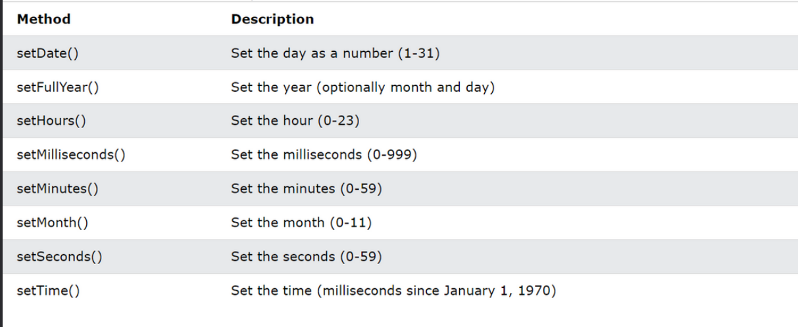

# What is new Date in JavaScript ?

## Creating date and time

## A JavaScript date is fundamentally specified as the time in milliseconds that has elapsed since the epoch, which is defined as the midnight at the beginning of January 1, 1970, UTC (equivalent to the UNIX epoch). This timestamp is timezone-agnostic and uniquely defines an instant in history.

#### ***(В основе JavaScript дата определяется как время в миллисекундах, прошедшее с момента эпохи, которая определяется как полночь в начале января. прошедшее с момента эпохи, которая определяется как полночь в начале января 1, 1970, UTC (эквивалентно эпохе UNIX). Эта временная метка не зависит от часового пояса и однозначно определяет момент в истории.)***


## The `Date()` constructor creates Date objects. When called as a function, it returns a string representing the current time.

#### ***(Конструктор `Date()` в JavaScript используется для создания новых объектов типа "дата" для работы с датами и временем. Вот пример простого использования:)***

```
// Создание объекта Date с текущей датой и временем
let currentDate = new Date();

// Вывод текущей даты и времени
console.log(currentDate);

```

___

## Creating Date Objects:
### There are four ways to create a date object.

* new Date();
* new Date(milliseconds)
* new Date (date string)
* new Date(year, month, day, hours,minutes,seconds,milliseconds)

## D A T E ( ) , d a t e ( m s )

## `new Date()`-creates a date object with the current date and time:

### JavaScript stores dates as number of milliseconds since January 01, 1970. Zero time is January 01, 1970 00:00:00 UTC. One day (24 hours) is 86 400 000 milliseconds. new Date(milliseconds) creates a new date object as milliseconds plus zero time:

#### ***(JavaScript хранит даты как количество миллисекунд, прошедших с 01 января 1970 года. Нулевое время - это 01 января 1970 года 00:00:00 UTC. Один день (24часов) составляет 86 400 000 миллисекунд.new Date(milliseconds) создает новый объект даты как миллисекунды плюс нулевое время:)***


___

## D A T E ( s t r i n g )

### `new Date(string)`- creates a date object from a date string
#### ***(Конструктор `Date(string)` в JavaScript используется для создания нового объекта типа "дата" из строки, представляющей дату и время. Вот пример:)***

```
// Создание объекта Date из строки
let dateString = "March 6, 2024 12:00:00";
let dateObject = new Date(dateString);

// Вывод объекта Date
console.log(dateObject);

```

#### ***Этот код создаст новый объект `Date`, используя строку `"March 6, 2024 12:00:00"` в качестве источника данных. JavaScript попытается интерпретировать эту строку и создать объект с соответствующей датой и временем.***

## DATE(year,month,day,...)

### new Date(year,month,day,hour,minute,second,millisecond) - creates a date object with a specified date and time. 7 numbers specify year, month, day, hour, minute, second, and millisecond (in that order):JavaScript counts months from 0 to 11: January = 0. December = 11.

#### ***(Функция Date(year, month, day, ...) в JavaScript используется для создания нового объекта типа "дата" с указанным годом, месяцем, днем и при необходимости другими атрибутами времени. Вот пример:)***

```
// Создание объекта Date с указанным годом, месяцем и днем
let date = new Date(2024, 2, 6); // Месяц начинается с 0 (0 - январь, 1 - февраль и т.д.), поэтому 2 означает март

// Вывод объекта Date
console.log(date);

```

#### ***Этот код создаст новый объект Date с датой, указанной как 6 марта 2024 года. Обратите внимание, что месяцы отсчитываются с 0 (январь) до 11 (декабрь).***

___

## DATE Methods get


___

### Date Set Methods (Методы установки даты) в JavaScript предназначены для изменения компонентов даты и времени объекта Date. Они позволяют установить новые значения для года, месяца, дня, часа, минуты, секунды и миллисекунд. Эти методы могут быть использованы для динамического изменения объекта Date, вместо создания нового объекта с новыми значениями. Вот краткое описание этих методов:

1. **setFullYear(year [, month, day])**:
   - Устанавливает год даты на указанное значение. Опционально можно указать также месяц и день.

2. **setMonth(month [, day])**:
   - Устанавливает месяц даты на указанное значение. Опционально можно указать день.

3. **setDate(day)**:
   - Устанавливает день месяца даты на указанное значение.

4. **setHours(hour [, min, sec, ms])**:
   - Устанавливает час даты на указанное значение. Опционально можно указать минуты, секунды и миллисекунды.

5. **setMinutes(min [, sec, ms])**:
   - Устанавливает минуты даты на указанное значение. Опционально можно указать секунды и миллисекунды.

6. **setSeconds(sec [, ms])**:
   - Устанавливает секунды даты на указанное значение. Опционально можно указать миллисекунды.

7. **setMilliseconds(ms)**:
   - Устанавливает миллисекунды даты на указанное значение.

#### ***Каждый из этих методов принимает соответствующие значения времени в качестве аргументов и обновляет соответствующие компоненты объекта Date.***

____

### Простыми словами, методы получения (get methods) объекта Date используются для получения информации о дате и времени, а методы установки (set methods) используются для изменения этой информации.

```
// Пример метода получения
const currentDate = new Date();
const currentYear = currentDate.getFullYear(); // Получаем текущий год
console.log("Текущий год:", currentYear);

// Пример метода установки
const futureDate = new Date();
futureDate.setFullYear(2025); // Устанавливаем год 2025
console.log("Год в будущем:", futureDate.getFullYear());

```

### ***Метод `getFullYear()` (метод получения) используется для получения текущего года из объекта `currentDate`. Метод `setFullYear(2025)` (метод установки) используется для установки года объекта `futureDate` на 2025.***

___



___

## Date Methods : now, getTime

### The `getTime()` method returns the number of milliseconds since January 1, 1970:

#### ***(Методы now и `getTime` в объекте `Date` используются для получения информации о текущем времени или времени определенной даты. Вот простое объяснение каждого метода: `now`: Метод `now` возвращает текущую дату и время в миллисекундах с начала эпохи (1 января 1970 года 00:00:00 UTC). Этот метод часто используется для получения текущего времени в момент вызова.)***

```
const currentTime = Date.now();
console.log(currentTime); // Выведет количество миллисекунд, прошедших с начала эпохи

```

___

### `Date.now()` returns the number of milliseconds since January 1, 1970. `Date.now()` is a static method of the `Date object.You cannot use it on a date object like myDate.now(). The syntax is always Date.now().

#### ***(Метод getTime возвращает количество миллисекунд, прошедших с начала эпохи, для указанной даты (или текущей даты, если не указано).Этот метод полезен для получения времени в миллисекундах для конкретной даты.)***

```
const currentDate = new Date();
const timestamp = currentDate.getTime();
console.log(timestamp); // Выведет количество миллисекунд, прошедших с начала эпохи для текущей даты

```

### ***Оба метода возвращают время в миллисекундах, что обычно используется для вычислений или сравнений дат в JavaScript.***

____

## What is new Map in JavaScript ?